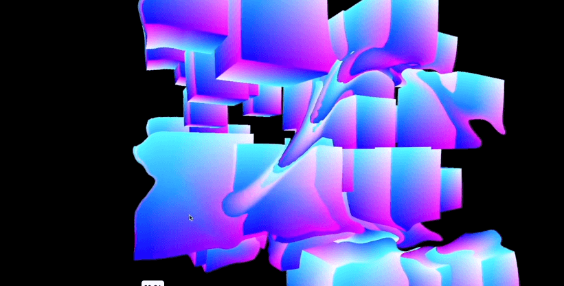

# Awwwards - Practical WebGL from scratch for frontend developers
As it is based upon OpenGL, which by itself is heavily intertwined with video games and computer graphics, WebGL gives us fully fledged access to the GPU from Javascript and the ability to do advanced graphics programming with shaders right in the browser.

https://www.awwwards.com/academy/course/practical-webgl-from-scratch-for-frontend-developers

## Roadmap Progression

### Part 1. Intro
- [x] 1-1 - Welcome
- [x] 1-2 - Brief history of WebGL and web graphics

### Part 2. WebGL drawing fundamentals
- [x] 2-1 - App boilerplate
- [x] 2-2 - Drawing a single point
- [ ] 2-3 - The WebGL coordinate system
- [ ] 2-4 - Adding more points with mouse clicks
- [ ] 2-5 - Drawing lines
- [ ] 2-6 - Drawing a quad

### Part 3. WebGL Textures
- [ ] 3-1 - Texture from image
- [ ] 3-2 - Texture from video
- [ ] 3-3 - Texture from HTML5 canvas

### Part 4. Debugging WebGL Applications
- [ ] 4-1 - Debugging WebGL Applications

### Part 5. Transformations
- [ ] 5-1 - Translation
- [ ] 5-2 - Translation with matrix
- [ ] 5-3 - Scaling with matrix
- [ ] 5-4 - Rotation with matrix
- [ ] 5-5 - Combining matrices

### Part 6. Building a WebGL slider
- [ ] 6-1 - Building a WebGL slider

### Part 7. Building an image scroll effect
- [ ] 7-1 - Building an image scroll effect

### Part 8. Building a camera effect
- [ ] 8-1 - Building a camera effect

### Part 9. Particles animation
- [ ] 9-1 - Particles animation

### Part 10. Conclusion
- [ ] 10-1 - Conclusion